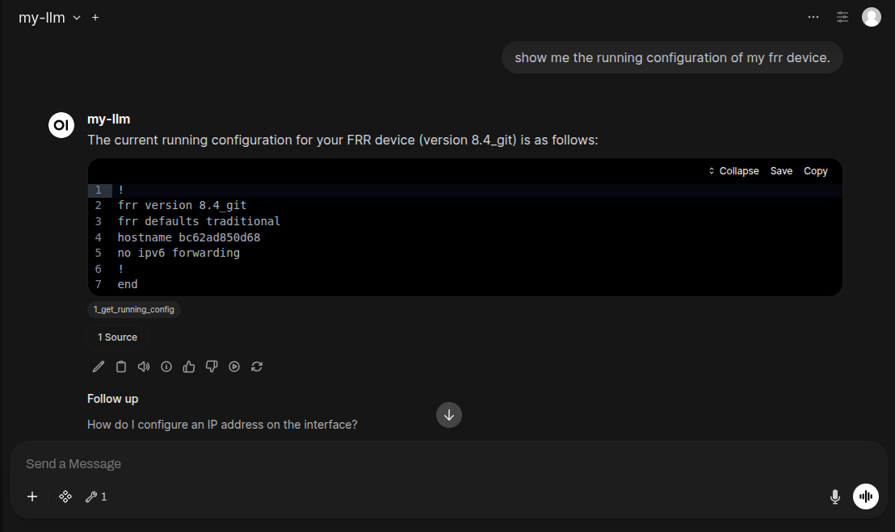
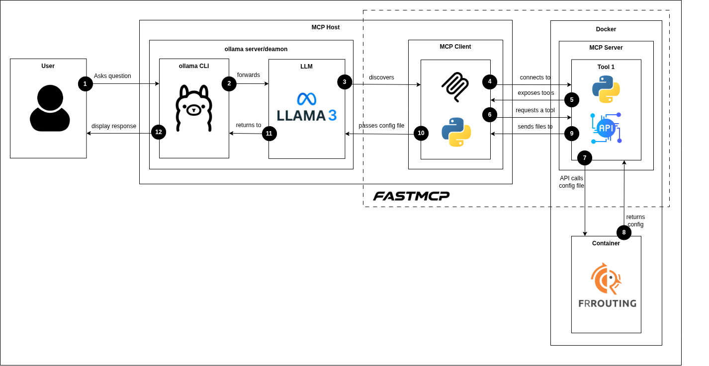

# MCP with Ollama
<<<<<<< HEAD
A chatbot that uses the MCP protocol to talk to network devices.   
=======
An LLM that uses an MCP tool to talk to network devices via telnet.  
>>>>>>> 68bebe542ac097073cfc95fb74aa9df5744c5e03

## Frontend


## Architecture Diagram


FastMCP address: http://127.0.0.1:9090/mcp
Ollama address: http://127.0.0.1:11434

## FFRouting
It is a "software that implements and manages various IPv4 and IPv6 routing protocols."
Docker image: [ frrouting / frr](https://hub.docker.com/r/frrouting/frr)

## Config File Output  
```
root@hp-laptop:~$ docker run -d --privileged --name my-frr --net=host frrouting/frr:v8.4.0  # pulls img and starts it if not present
root@hp-laptop:~$ docker exec -it my-frr /bin/bash  # enters container env
bash-5.1# vtysh
hp-laptop# show running-config 
Building configuration...

Current configuration:
!
frr version 8.4_git
frr defaults traditional
hostname hp-laptop
no ipv6 forwarding
!
end
hp-laptop#  
bash-5.1# 
exit
```

## Sources
[Installation with Default Configuration](https://github.com/open-webui/open-webui#troubleshooting)  
[Building Your First Agentic AI: Complete Guide to MCP + Ollama Tool Calling](https://dev.to/ajitkumar/building-your-first-agentic-ai-complete-guide-to-mcp-ollama-tool-calling-2o8g)  
